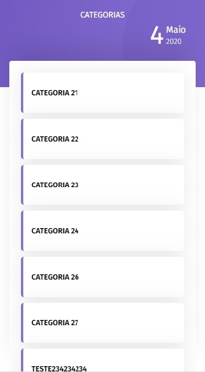

# Todo-List Alelo 😜

  
  "

  
  

<h3 align="left">Install project</h3>

<ul>
    <li>npm install</li>
</ul>

<h3 align="left">Run project</h3>

<ul>
    <li>ng serve</li>
</ul>

<h3 align="left">Open project</h3>

<ul>
    <li>http://localhost:4200 😄💻</li>
</ul>

